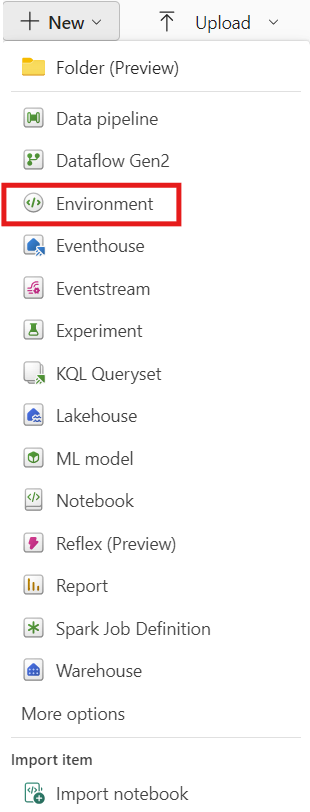
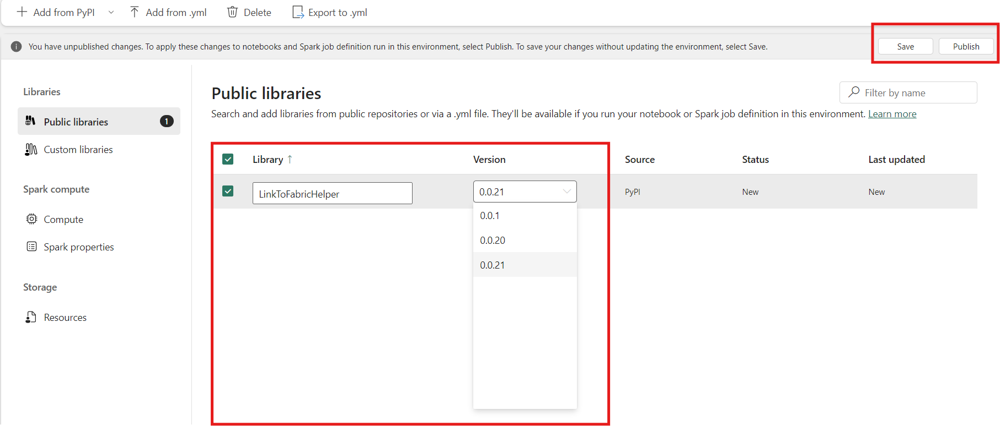
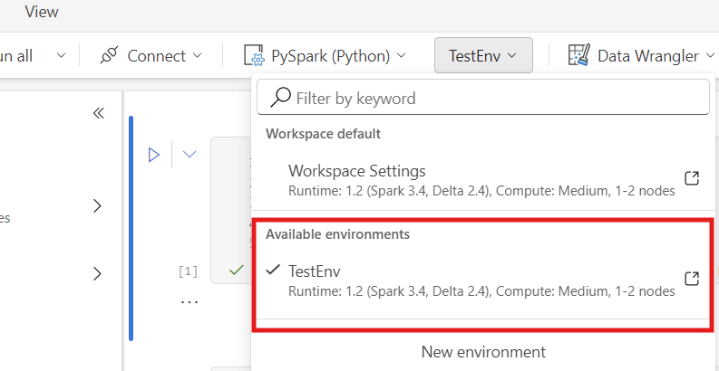
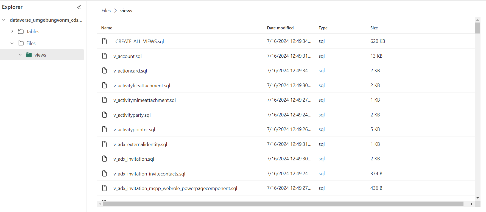

# Generate views with dereferenced options

### Overview

Tables exported from dataverse with tend to be wide with lots of referenced columns which makes a lookup in one of the reference tables below necessary. The joins needed are not complex but due to the heavy large number of columns an automated approach seems obvious. 

The labels to the options are stored in these optionset tables:

* OptionsetMetadata: Stores the typical optionset metadata differentiated by language codes.
* GlobalOptionsetMetadata: Similar idea to OptionsetMetadata but with optionsets that are globally defined and used in different tables - possibly with different aliases.
* StatusMetadata: Labels for the system column StatusCode.
* StateMetadata: Labels for the system column StateCode.

There is one more metadata table - TargetMetadata - which holds useful information (foreign key information between tables) but is not necessary to derefernce options. 

Each of the four metadata tables above basically holds the following information: 

* Tablename of the referenced option
* Columnname of the references option
* Code for one specific label
* Label that corresponds to the code 
* Languagecode (quite interesting if the  options are associated with multilanguage labels)

### Step-by-step guide on how to create views

First of all you need to create an environment and load the package from PyPI. In Fabric this can easily be done with the environment item: 



In the environment you can add the package from the public PyPI repository. Select the newest version available and make sure to save and publish your changes (can take a couple of minutes at the time of writting this). 



This environment can then be attached to your notebook that you want to use to create the views. Start a session with this environment after attachment.



Be aware that the lakehouse that was created by the "Link to Microsoft Fabric" functionality has to be mounted to the notebook where you create the views. 

Execute the following code block(s) in the notebook to create the views:

```
# import the module:
from LinkToFabricHelper import CdmSchema as ltfh

# initiate a new object to capture the CDM-Schema
schema = ltfh.CdmSchem(metadata_connector='fabric' 
                       spark_session=spark, 
                       language_code=1031)

# populate schema (might take some time)
schema.populate_schema()

# create views
schema.create_views(output_folder="views", 
                    view_prefix="v_", 
                    keep_options=False)
```

This code will generate the views under Files/views in the lakehehouse (to be precise in OneLake). Be aware that the chosen output folder needs to be created in advance. 



The following options can be set:

* 'metadata_connector': Has to be set to 'fabric' (other option 'pyodbc' only available for execution on local machine).
* 'spark_session': Has to be set to 'spark' since this is the SparkSession-object created by Fabric and the API to the active spark-session. 
* 'language_code': Defaults to 1033 (English) but it is recommended to examine the metadata tables before to find out which languagecode is desired. Also review the list of language code with ``` SELECT [Option], LocalizedLabel FROM dbo.GlobalOptionsetMetadata WHERE OptionSetName = 'language' ORDER BY [Option]  ```
* 'output_folder': Folder under 'Files' where the .sql files with the views should be created to but be aware that the folder needs to exist prior to the execution. 
* 'view_prefix': A prefix that every view has in its name prior to the entity name. 
* 'keep_options': 
    * If set to false the options are replaced by their labels (under the same column name as the option before).
    * If set to false the labels are joined in addition to the options. In that case each option column results in one column with '_option' after the original column name containing the original option as integer and one column with '_label' after the original column name containing the corresponding option. 

An exemplary view of a table could then look like: 
```sql
CREATE OR ALTER VIEW v_entity_mailbox 
 AS 
 SELECT tab.[Id] 
       ,tab.[SinkCreatedOn] 
       ,tab.[SinkModifiedOn] 
       ,tab.[statecode] AS [statecode_option] 
       ,col4.[LocalizedLabel] AS [statecode_label]
       ,tab.[statuscode] AS [statuscode_option] 
       ,col5.[LocalizedLabel] AS [statuscode_label]
       ,tab.[actdeliverymethod] AS [actdeliverymethod_option] 
       ,col6.[LocalizedLabel] AS [actdeliverymethod_label]
       ,tab.[actstatus] AS [actstatus_option] 
       ,col7.[LocalizedLabel] AS [actstatus_label]
       ,tab.[emailrouteraccessapproval] AS [emailrouteraccessapproval_option] 
       ,col8.[LocalizedLabel] AS [emailrouteraccessapproval_label]
       ,tab.[exchangecontactsimportstatus] AS [exchangecontactsimportstatus_option] 
       ,col9.[LocalizedLabel] AS [exchangecontactsimportstatus_label]
       ,tab.[incomingemaildeliverymethod] AS [incomingemaildeliverymethod_option] 
       ,col10.[LocalizedLabel] AS [incomingemaildeliverymethod_label]
       ,tab.[incomingemailstatus] AS [incomingemailstatus_option] 
       ,col11.[LocalizedLabel] AS [incomingemailstatus_label]
       ,tab.[mailboxstatus] AS [mailboxstatus_option] 
       ,col12.[LocalizedLabel] AS [mailboxstatus_label]
       ,tab.[officeappsdeploymentstatus] AS [officeappsdeploymentstatus_option] 
       ,col13.[LocalizedLabel] AS [officeappsdeploymentstatus_label]
       ,tab.[outgoingemaildeliverymethod] AS [outgoingemaildeliverymethod_option] 
       ,col14.[LocalizedLabel] AS [outgoingemaildeliverymethod_label]
       ,tab.[outgoingemailstatus] AS [outgoingemailstatus_option] 
       ,col15.[LocalizedLabel] AS [outgoingemailstatus_label]
       ,tab.[allowemailconnectortousecredentials] AS [allowemailconnectortousecredentials_option] 
       ,col16.[LocalizedLabel] AS [allowemailconnectortousecredentials_label]
       ,tab.[enabledforact] AS [enabledforact_option] 
       ,col17.[LocalizedLabel] AS [enabledforact_label]
       ,tab.[enabledforincomingemail] AS [enabledforincomingemail_option] 
       ,col18.[LocalizedLabel] AS [enabledforincomingemail_label]
       ,tab.[enabledforoutgoingemail] AS [enabledforoutgoingemail_option] 
       ,col19.[LocalizedLabel] AS [enabledforoutgoingemail_label]
       ,tab.[isactsyncorgflagset] AS [isactsyncorgflagset_option] 
       ,col20.[LocalizedLabel] AS [isactsyncorgflagset_label]
       ,tab.[isemailaddressapprovedbyo365admin] AS [isemailaddressapprovedbyo365admin_option] 
       ,col21.[LocalizedLabel] AS [isemailaddressapprovedbyo365admin_label]
       ,tab.[isexchangecontactsimportscheduled] AS [isexchangecontactsimportscheduled_option] 
       ,col22.[LocalizedLabel] AS [isexchangecontactsimportscheduled_label]
       ,tab.[isforwardmailbox] AS [isforwardmailbox_option] 
       ,col23.[LocalizedLabel] AS [isforwardmailbox_label]
       ,tab.[isoauthaccesstokenset] AS [isoauthaccesstokenset_option] 
       ,col24.[LocalizedLabel] AS [isoauthaccesstokenset_label]
       ,tab.[isoauthrefreshtokenset] AS [isoauthrefreshtokenset_option] 
       ,col25.[LocalizedLabel] AS [isoauthrefreshtokenset_label]
       ,tab.[ispasswordset] AS [ispasswordset_option] 
       ,col26.[LocalizedLabel] AS [ispasswordset_label]
       ,tab.[isserviceaccount] AS [isserviceaccount_option] 
       ,col27.[LocalizedLabel] AS [isserviceaccount_label]
       ,tab.[lasttagprocessedmaxitems] AS [lasttagprocessedmaxitems_option] 
       ,col28.[LocalizedLabel] AS [lasttagprocessedmaxitems_label]
       ,tab.[officeappsdeploymentscheduled] AS [officeappsdeploymentscheduled_option] 
       ,col29.[LocalizedLabel] AS [officeappsdeploymentscheduled_label]
       ,tab.[orgmarkedasprimaryforexchangesync] AS [orgmarkedasprimaryforexchangesync_option] 
       ,col30.[LocalizedLabel] AS [orgmarkedasprimaryforexchangesync_label]
       ,tab.[processanddeleteemails] AS [processanddeleteemails_option] 
       ,col31.[LocalizedLabel] AS [processanddeleteemails_label]
       ,tab.[testemailconfigurationscheduled] AS [testemailconfigurationscheduled_option] 
       ,col32.[LocalizedLabel] AS [testemailconfigurationscheduled_label]
       ,tab.[createdby] 
       ,tab.[createdby_entitytype] 
       ,tab.[createdonbehalfby] 
       ,tab.[createdonbehalfby_entitytype] 
       ,tab.[emailserverprofile] 
       ,tab.[emailserverprofile_entitytype] 
       ,tab.[modifiedby] 
       ,tab.[modifiedby_entitytype] 
       ,tab.[modifiedonbehalfby] 
       ,tab.[modifiedonbehalfby_entitytype] 
       ,tab.[organizationid] 
       ,tab.[organizationid_entitytype] 
       ,tab.[owningbusinessunit] 
       ,tab.[owningbusinessunit_entitytype] 
       ,tab.[owningteam] 
       ,tab.[owningteam_entitytype] 
       ,tab.[owninguser] 
       ,tab.[owninguser_entitytype] 
       ,tab.[regardingobjectid] 
       ,tab.[regardingobjectid_entitytype] 
       ,tab.[ownerid] 
       ,tab.[ownerid_entitytype] 
       ,tab.[averagetotalduration] 
       ,tab.[createdbyname] 
       ,tab.[createdbyyominame] 
       ,tab.[createdon] 
       ,tab.[createdonbehalfbyname] 
       ,tab.[createdonbehalfbyyominame] 
       ,tab.[emailaddress] 
       ,tab.[emailserverprofilename] 
       ,tab.[entityimage] 
       ,tab.[entityimage_timestamp] 
       ,tab.[entityimage_url] 
       ,tab.[entityimageid] 
       ,tab.[ewsurl] 
       ,tab.[exchangecontactsimportcompletedon] 
       ,tab.[exchangesyncstatexml] 
       ,tab.[exchangesyncstatexmlfileref] 
       ,tab.[exchangesyncstatexmlfileref_name] 
       ,tab.[folderhierarchy] 
       ,tab.[forcedunlockcount] 
       ,tab.[hostid] 
       ,tab.[itemsfailedforlastsync] 
       ,tab.[itemsprocessedforlastsync] 
       ,tab.[lastactiveon] 
       ,tab.[lastautodiscoveredon] 
       ,tab.[lastduration] 
       ,tab.[lastmailboxforcedunlockoccurredon] 
       ,tab.[lastmessageid] 
       ,tab.[lastsuccessfulsynccompletedon] 
       ,tab.[lastsyncerror] 
       ,tab.[lastsyncerrorcode] 
       ,tab.[lastsyncerrorcount] 
       ,tab.[lastsyncerrormachinename] 
       ,tab.[lastsyncerroroccurredon] 
       ,tab.[lastsyncstartedon] 
       ,tab.[lasttagcompletedon] 
       ,tab.[lasttaggedmessageid] 
       ,tab.[mailboxid] 
       ,tab.[mailboxprocessingcontext] 
       ,tab.[modifiedbyname] 
       ,tab.[modifiedbyyominame] 
       ,tab.[modifiedon] 
       ,tab.[modifiedonbehalfbyname] 
       ,tab.[modifiedonbehalfbyyominame] 
       ,tab.[name] 
       ,tab.[nextscheduledactsyncinseconds] 
       ,tab.[noactcount] 
       ,tab.[noemailcount] 
       ,tab.[oauthaccesstoken] 
       ,tab.[oauthrefreshtoken] 
       ,tab.[oauthtokenexpireson] 
       ,tab.[officeappsdeploymentcompleteon] 
       ,tab.[officeappsdeploymenterror] 
       ,tab.[organizationidname] 
       ,tab.[owneridname] 
       ,tab.[owneridtype] 
       ,tab.[owneridyominame] 
       ,tab.[owningbusinessunitname] 
       ,tab.[password] 
       ,tab.[postponemailboxprocessinguntil] 
       ,tab.[postponeofficeappsdeploymentuntil] 
       ,tab.[postponesendinguntil] 
       ,tab.[postponetestemailconfigurationuntil] 
       ,tab.[processedtimes] 
       ,tab.[processemailreceivedafter] 
       ,tab.[processinglastattemptedon] 
       ,tab.[processingstatecode] 
       ,tab.[receivingpostponeduntil] 
       ,tab.[receivingpostponeduntilforact] 
       ,tab.[regardingobjectidname] 
       ,tab.[regardingobjecttypecode] 
       ,tab.[tagemailsafter] 
       ,tab.[testemailconfigurationretrycount] 
       ,tab.[testmailboxaccesscompletedon] 
       ,tab.[timezoneruleversionnumber] 
       ,tab.[transientfailurecount] 
       ,tab.[undeliverablefolder] 
       ,tab.[username] 
       ,tab.[utcconversiontimezonecode] 
       ,tab.[verboseloggingenabled] 
       ,tab.[versionnumber] 
       ,tab.[IsDelete] 
       ,tab.[PartitionId] 
FROM mailbox AS tab 
 LEFT JOIN StateMetadata AS col4 
  ON tab.[statecode] = col4.[State] 
 AND col4.EntityName = 'mailbox' 
 AND col4.LocalizedLabelLanguageCode = 1031 
 LEFT JOIN StatusMetadata AS col5 
  ON tab.[statuscode] = col5.[Status] 
 AND col5.EntityName = 'mailbox' 
 AND col5.LocalizedLabelLanguageCode = 1031 
 LEFT JOIN OptionsetMetadata AS col6 
  ON tab.[actdeliverymethod] = col6.[Option] 
 AND col6.EntityName = 'mailbox' 
 AND col6.LocalizedLabelLanguageCode = 1031 
 AND col6.OptionSetName = 'actdeliverymethod' 
 LEFT JOIN OptionsetMetadata AS col7 
  ON tab.[actstatus] = col7.[Option] 
 AND col7.EntityName = 'mailbox' 
 AND col7.LocalizedLabelLanguageCode = 1031 
 AND col7.OptionSetName = 'actstatus' 
 LEFT JOIN OptionsetMetadata AS col8 
  ON tab.[emailrouteraccessapproval] = col8.[Option] 
 AND col8.EntityName = 'mailbox' 
 AND col8.LocalizedLabelLanguageCode = 1031 
 AND col8.OptionSetName = 'emailrouteraccessapproval' 
 LEFT JOIN OptionsetMetadata AS col9 
  ON tab.[exchangecontactsimportstatus] = col9.[Option] 
 AND col9.EntityName = 'mailbox' 
 AND col9.LocalizedLabelLanguageCode = 1031 
 AND col9.OptionSetName = 'exchangecontactsimportstatus' 
 LEFT JOIN OptionsetMetadata AS col10 
  ON tab.[incomingemaildeliverymethod] = col10.[Option] 
 AND col10.EntityName = 'mailbox' 
 AND col10.LocalizedLabelLanguageCode = 1031 
 AND col10.OptionSetName = 'incomingemaildeliverymethod' 
 LEFT JOIN OptionsetMetadata AS col11 
  ON tab.[incomingemailstatus] = col11.[Option] 
 AND col11.EntityName = 'mailbox' 
 AND col11.LocalizedLabelLanguageCode = 1031 
 AND col11.OptionSetName = 'incomingemailstatus' 
 LEFT JOIN OptionsetMetadata AS col12 
  ON tab.[mailboxstatus] = col12.[Option] 
 AND col12.EntityName = 'mailbox' 
 AND col12.LocalizedLabelLanguageCode = 1031 
 AND col12.OptionSetName = 'mailboxstatus' 
 LEFT JOIN OptionsetMetadata AS col13 
  ON tab.[officeappsdeploymentstatus] = col13.[Option] 
 AND col13.EntityName = 'mailbox' 
 AND col13.LocalizedLabelLanguageCode = 1031 
 AND col13.OptionSetName = 'officeappsdeploymentstatus' 
 LEFT JOIN OptionsetMetadata AS col14 
  ON tab.[outgoingemaildeliverymethod] = col14.[Option] 
 AND col14.EntityName = 'mailbox' 
 AND col14.LocalizedLabelLanguageCode = 1031 
 AND col14.OptionSetName = 'outgoingemaildeliverymethod' 
 LEFT JOIN OptionsetMetadata AS col15 
  ON tab.[outgoingemailstatus] = col15.[Option] 
 AND col15.EntityName = 'mailbox' 
 AND col15.LocalizedLabelLanguageCode = 1031 
 AND col15.OptionSetName = 'outgoingemailstatus' 
 LEFT JOIN OptionsetMetadata AS col16 
  ON tab.[allowemailconnectortousecredentials] = col16.[Option] 
 AND col16.EntityName = 'mailbox' 
 AND col16.LocalizedLabelLanguageCode = 1031 
 AND col16.OptionSetName = 'allowemailconnectortousecredentials' 
 LEFT JOIN OptionsetMetadata AS col17 
  ON tab.[enabledforact] = col17.[Option] 
 AND col17.EntityName = 'mailbox' 
 AND col17.LocalizedLabelLanguageCode = 1031 
 AND col17.OptionSetName = 'enabledforact' 
 LEFT JOIN OptionsetMetadata AS col18 
  ON tab.[enabledforincomingemail] = col18.[Option] 
 AND col18.EntityName = 'mailbox' 
 AND col18.LocalizedLabelLanguageCode = 1031 
 AND col18.OptionSetName = 'enabledforincomingemail' 
 LEFT JOIN OptionsetMetadata AS col19 
  ON tab.[enabledforoutgoingemail] = col19.[Option] 
 AND col19.EntityName = 'mailbox' 
 AND col19.LocalizedLabelLanguageCode = 1031 
 AND col19.OptionSetName = 'enabledforoutgoingemail' 
 LEFT JOIN OptionsetMetadata AS col20 
  ON tab.[isactsyncorgflagset] = col20.[Option] 
 AND col20.EntityName = 'mailbox' 
 AND col20.LocalizedLabelLanguageCode = 1031 
 AND col20.OptionSetName = 'isactsyncorgflagset' 
 LEFT JOIN OptionsetMetadata AS col21 
  ON tab.[isemailaddressapprovedbyo365admin] = col21.[Option] 
 AND col21.EntityName = 'mailbox' 
 AND col21.LocalizedLabelLanguageCode = 1031 
 AND col21.OptionSetName = 'isemailaddressapprovedbyo365admin' 
 LEFT JOIN OptionsetMetadata AS col22 
  ON tab.[isexchangecontactsimportscheduled] = col22.[Option] 
 AND col22.EntityName = 'mailbox' 
 AND col22.LocalizedLabelLanguageCode = 1031 
 AND col22.OptionSetName = 'isexchangecontactsimportscheduled' 
 LEFT JOIN OptionsetMetadata AS col23 
  ON tab.[isforwardmailbox] = col23.[Option] 
 AND col23.EntityName = 'mailbox' 
 AND col23.LocalizedLabelLanguageCode = 1031 
 AND col23.OptionSetName = 'isforwardmailbox' 
 LEFT JOIN GlobalOptionsetMetadata AS col24 
  ON tab.[isoauthaccesstokenset] = col24.[Option] 
 AND col24.EntityName = 'mailbox' 
 AND col24.LocalizedLabelLanguageCode = 1031 
 AND col24.OptionSetName = 'isoauthaccesstokenset' 
 LEFT JOIN GlobalOptionsetMetadata AS col25 
  ON tab.[isoauthrefreshtokenset] = col25.[Option] 
 AND col25.EntityName = 'mailbox' 
 AND col25.LocalizedLabelLanguageCode = 1031 
 AND col25.OptionSetName = 'isoauthrefreshtokenset' 
 LEFT JOIN GlobalOptionsetMetadata AS col26 
  ON tab.[ispasswordset] = col26.[Option] 
 AND col26.EntityName = 'mailbox' 
 AND col26.LocalizedLabelLanguageCode = 1031 
 AND col26.OptionSetName = 'ispasswordset' 
 LEFT JOIN OptionsetMetadata AS col27 
  ON tab.[isserviceaccount] = col27.[Option] 
 AND col27.EntityName = 'mailbox' 
 AND col27.LocalizedLabelLanguageCode = 1031 
 AND col27.OptionSetName = 'isserviceaccount' 
 LEFT JOIN OptionsetMetadata AS col28 
  ON tab.[lasttagprocessedmaxitems] = col28.[Option] 
 AND col28.EntityName = 'mailbox' 
 AND col28.LocalizedLabelLanguageCode = 1031 
 AND col28.OptionSetName = 'lasttagprocessedmaxitems' 
 LEFT JOIN OptionsetMetadata AS col29 
  ON tab.[officeappsdeploymentscheduled] = col29.[Option] 
 AND col29.EntityName = 'mailbox' 
 AND col29.LocalizedLabelLanguageCode = 1031 
 AND col29.OptionSetName = 'officeappsdeploymentscheduled' 
 LEFT JOIN OptionsetMetadata AS col30 
  ON tab.[orgmarkedasprimaryforexchangesync] = col30.[Option] 
 AND col30.EntityName = 'mailbox' 
 AND col30.LocalizedLabelLanguageCode = 1031 
 AND col30.OptionSetName = 'orgmarkedasprimaryforexchangesync' 
 LEFT JOIN OptionsetMetadata AS col31 
  ON tab.[processanddeleteemails] = col31.[Option] 
 AND col31.EntityName = 'mailbox' 
 AND col31.LocalizedLabelLanguageCode = 1031 
 AND col31.OptionSetName = 'processanddeleteemails' 
 LEFT JOIN OptionsetMetadata AS col32 
  ON tab.[testemailconfigurationscheduled] = col32.[Option] 
 AND col32.EntityName = 'mailbox' 
 AND col32.LocalizedLabelLanguageCode = 1031 
 AND col32.OptionSetName = 'testemailconfigurationscheduled' 
GO 
```

Currently it is not possible to execute the "CREATE VIEW" script on the sql endpoint directly out of a Fabric notebook. This feature was inofficially announced in a blog article for later in 2024. As soon as this feature is available the creation and update of such views can be done completely automated in such a notebook. 

